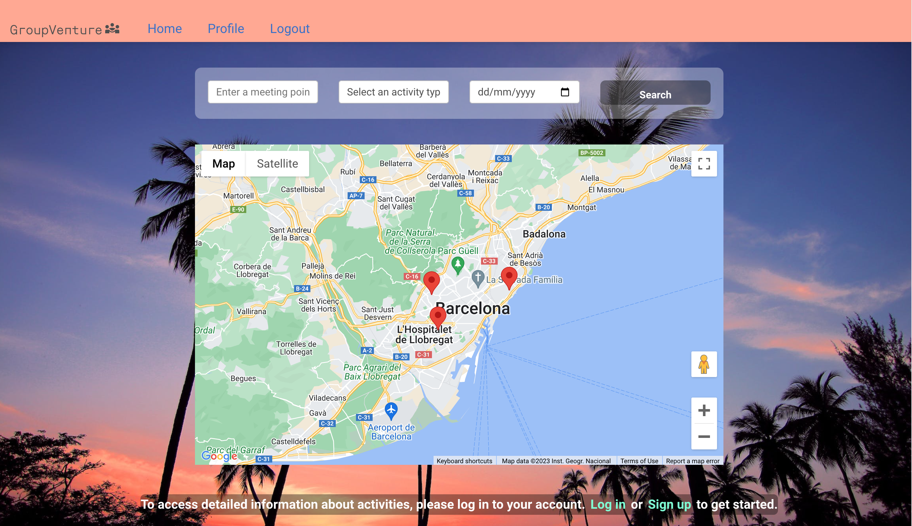
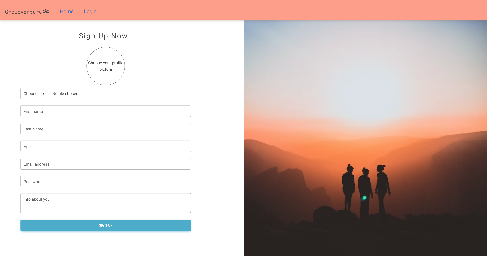
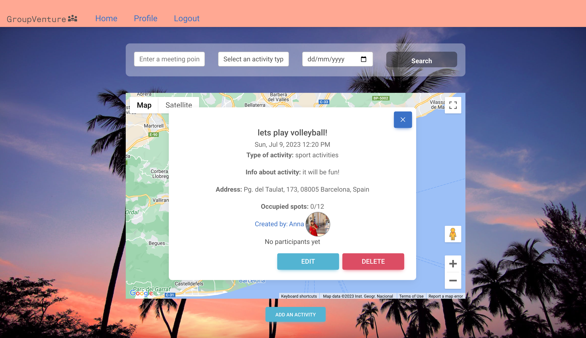

bgdbdbgb

# **GroupVenture** 
GroupVenture is a versatile and user-friendly app designed to connect individuals with shared interests and facilitate the organization of various activities. Whether you're looking for a hiking partner, a study group, a sports team, or a gaming session, grouVenture provides a platform where users can create, join, and participate in a wide range of activities. Whether you're looking to expand your social circle or pursue new adventures, groupVenture is the go-to app for turning your ideas into memorable group ventures.

## **Getting started**
### Clone the repository: [GroupVenture](https://github.com/AnnaKucherenko1/GroupVenture)
### Navigate to the client and server folders:
```console
cd server || cd client
```
### Install the required npm packages on each folder:

```console
npm install
```
### Install the required npm packages on each folder:
Set up the required environment variables or update and leave the default values for the PostgreSQL credentials and ports.
You will also need to add a Google Maps Api Key to the index.html and a Clodinary account to upload pictures. 
### Run the server in the back end and start the app in the front end with the same command:
```console
npm start 
```
## **Tech stack:** 
React, TypeScript, Express, PostgreSQL, vanilla CSS, Bootstrap, Google Maps API, Cloudinary. 
## **Screenshots**:
Home page

Log In page

Sign Up page

Profile

Edit Profile

Activity card
